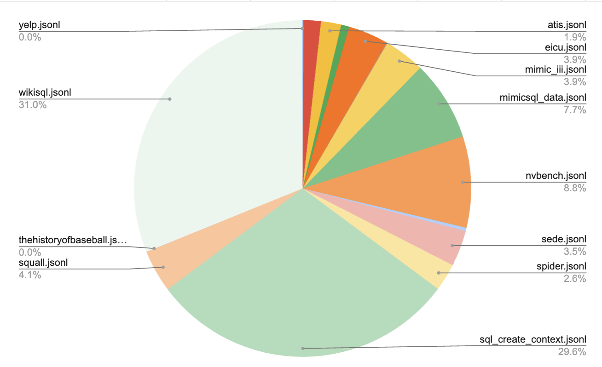

# zsql-sqlite-dpo

This is a dataset for training machine learning models to convert natural
English language text into SQLite dialect SQL queries.

This dataset comprises 200,000 DPO pairs curated to support the rapid
development of text-to-SQL generation models. The uniqueness of this dataset
lies in its optimization process. The "chosen" field within each data pair
contains SQL queries that have been canonicalized, optimized, and which are
chosen from the candidate set which minimizes syntactic cyclomatic and
asymptotic complexity against the given schema.

Direct Preference Optimization (see [Rafailov et al,
2023](https://arxiv.org/abs/2305.18290J) is a novel approach to refinement
learning from positive and negative samples to modify the behavior of
large-scale unsupervised language models to align with human preferences This
method simplifies the fine-tuning process, making it more stable and
computationally efficient without the need for extensive hyperparameter tuning
or LM sampling, and has been shown to effectively control model outputs,
matching or surpassing existing methods.

The source data is cleaned and filtered based on the following criteria:

- Remove queries which are not in English.
- Remove queries which are not valid SQL queries.
- Remove queries which are not executable against the given schema.
- Remove queries which are executed against tables with non-Latin characters.
- Remove queries which use features not supported by the given database.
- Remove long queries which contain domain-specific knowledge which cause model confusion.
- Remove queries which do not fit within a 4096 token context window.

## Usage

To load the dataset using the HuggingFace `datasets` library:

```python
from datasets import load_dataset

dataset = load_dataset("zerolink/zsql-sqlite-dpo")
```

To use in model fine-tuning, apply the following chat tokenizer:

```python
tokenizer = AutoTokenizer.from_pretrained(model)

def tokenize(element):
    schema = element["schema"]
    question = element["question"]
    answer = element["chosen"]

    prompt = f"""
    Using the schema:
    {schema}
    Generate SQL for the following question:
    {question}
    """

    system = "Translate English to SQLite SQL."
    message = [
        {"role": "system", "content": system},
        {"role": "user", "content": prompt},
        {"role": "assistant", "content": answer},
    ]
    output = tokenizer.apply_chat_template(
        message, add_generation_prompt=False, tokenize=True
    )
    return {"text": output}
```

## Fields

The fields in this dataset are as follows:

| Field Name | Description                                                                                     |
| ---------- | ----------------------------------------------------------------------------------------------- |
| schema     | The schema of the database.                                                                     |
| question   | The natural language question.                                                                  |
| chosen     | The DPO preferred SQL query.                                                                    |
| rejected   | The DPO rejected SQL query.                                                                     |
| weight     | The weight of the query in the reward function.                                                 |

## Sources

This dataset is derived from the following sources:

| Source                 | License      | External Link                                                                                                        |
| ---------------------- | ------------ | -------------------------------------------------------------------------------------------------------------------- |
| wikisql                | BSD 3-Clause | [https://github.com/salesforce/WikiSQL](https://github.com/salesforce/WikiSQL)                                       |
| spider                 | CC-BY-SA-4.0 | [https://huggingface.co/datasets/spider](https://huggingface.co/datasets/spider)                                     |
| sql_create_context     | CC-BY-4.0    | [https://huggingface.co/datasets/b-mc2/sql-create-context](https://huggingface.co/datasets/b-mc2/sql-create-context) |
| squall                 | CC-BY-SA-4.0 | [https://github.com/tzshi/squall](https://github.com/tzshi/squall)                                                   |
| sede                   | Apache-2.0   | [https://github.com/hirupert/sede](https://github.com/hirupert/sede)                                                 |
| nvbench                | MIT          | [https://github.com/TsinghuaDatabaseGroup/nvBench](https://github.com/TsinghuaDatabaseGroup/nvBench)                 |
| imdb                   | Not Found    | [https://github.com/jkkummerfeld/text2sql-data](https://github.com/jkkummerfeld/text2sql-data)                       |
| advising               | CC-BY-4.0    | [https://github.com/jkkummerfeld/text2sql-data](https://github.com/jkkummerfeld/text2sql-data)                       |
| atis                   | Not Found    | [https://github.com/jkkummerfeld/text2sql-data](https://github.com/jkkummerfeld/text2sql-data)                       |
| restaurants            | Not Found    | [https://github.com/jkkummerfeld/text2sql-data](https://github.com/jkkummerfeld/text2sql-data)                       |
| scholar                | Not Found    | [https://github.com/jkkummerfeld/text2sql-data](https://github.com/jkkummerfeld/text2sql-data)                       |
| yelp                   | Not Found    | [https://github.com/jkkummerfeld/text2sql-data](https://github.com/jkkummerfeld/text2sql-data)                       |
| academic               | Not Found    | [https://github.com/jkkummerfeld/text2sql-data](https://github.com/jkkummerfeld/text2sql-data)                       |
| criteria2sql           | Apache-2.0   | [https://github.com/xiaojingyu92/Criteria2SQL](https://github.com/xiaojingyu92/Criteria2SQL)                         |
| eICU                   | CC-BY-4.0    | [https://github.com/glee4810/EHRSQL](https://github.com/glee4810/EHRSQL)                                             |
| mimic_iii              | CC-BY-4.0    | [https://github.com/glee4810/EHRSQL](https://github.com/glee4810/EHRSQL)                                             |
| mimicsql_data          | MIT          | [https://github.com/wangpinggl/TREQS](https://github.com/wangpinggl/TREQS)                                           |
| worldsoccerdatabase    | CC-BY-SA-4.0 | [https://github.com/chiahsuan156/KaggleDBQA](https://github.com/chiahsuan156/KaggleDBQA)                             |
| whatcdhiphop           | CC-BY-SA-4.0 | [https://github.com/chiahsuan156/KaggleDBQA](https://github.com/chiahsuan156/KaggleDBQA)                             |
| studentmathscore       | CC-BY-SA-4.0 | [https://github.com/chiahsuan156/KaggleDBQA](https://github.com/chiahsuan156/KaggleDBQA)                             |
| pesticide              | CC-BY-SA-4.0 | [https://github.com/chiahsuan156/KaggleDBQA](https://github.com/chiahsuan156/KaggleDBQA)                             |
| thehistoryofbaseball   | CC-BY-SA-4.0 | [https://github.com/chiahsuan156/KaggleDBQA](https://github.com/chiahsuan156/KaggleDBQA)                             |
| uswildfires            | CC-BY-SA-4.0 | [https://github.com/chiahsuan156/KaggleDBQA](https://github.com/chiahsuan156/KaggleDBQA)                             |
| geonucleardata         | CC-BY-SA-4.0 | [https://github.com/chiahsuan156/KaggleDBQA](https://github.com/chiahsuan156/KaggleDBQA)                             |
| greatermanchestercrime | CC-BY-SA-4.0 | [https://github.com/chiahsuan156/KaggleDBQA](https://github.com/chiahsuan156/KaggleDBQA)                             |

Composition:



## License

This dataset is provided for academic and research purposes. Please adhere to
the specified license terms and conditions for usage and distribution.
